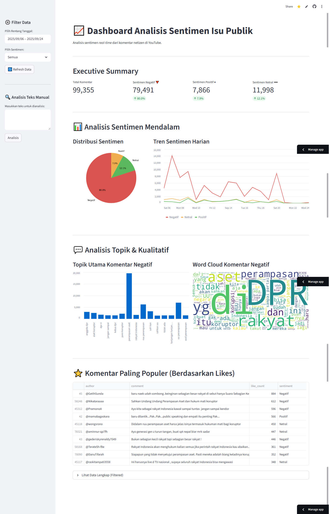
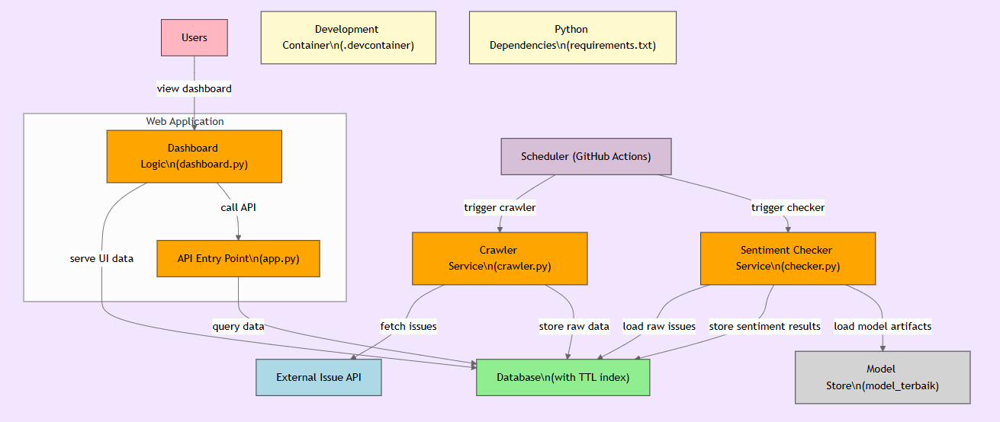

# Dashboard Analisis Sentimen Isu Publik



Sebuah dashboard interaktif untuk memvisualisasikan dan menganalisis sentimen publik dari komentar media sosial (YouTube) secara real-time. Proyek ini dibangun untuk memahami opini publik terhadap isu-isu yang sedang hangat dibicarakan.

---

## 📜 Latar Belakang

Proyek ini lahir dari rasa penasaran setelah melihat masifnya diskusi publik di media sosial pasca aksi demonstrasi awal September 2025. Tantangannya adalah: bagaimana kita bisa mengukur dan memahami ribuan suara netizen secara cepat dan objektif?

Dalam waktu 3 hari, proyek ini dikembangkan sebagai sebuah *proof-of-concept* untuk menunjukkan bagaimana data dapat digunakan untuk memetakan dan "mendengarkan" percakapan publik dalam skala besar.

## ✨ Fitur Utama

- **Analisis Sentimen Real-time**: Mengklasifikasikan komentar ke dalam kategori **Positif**, **Negatif**, dan **Netral** menggunakan model Machine Learning.
- **Visualisasi Tren Harian**: Grafik garis yang menunjukkan fluktuasi sentimen dari hari ke hari.
- **Topik Utama & Word Cloud**: Mengidentifikasi kata kunci yang paling sering muncul dalam komentar negatif untuk memahami pokok permasalahan.
- **Komentar Paling Populer**: Menampilkan daftar komentar dengan jumlah *likes* terbanyak.
- **Filter Data Interaktif**: Memungkinkan pengguna untuk memfilter data berdasarkan rentang tanggal dan jenis sentimen.

## 🛠️ Teknologi yang Digunakan

- **Bahasa**: Python
- **Dashboard**: Streamlit
- **Analisis Data**: Pandas, Scikit-learn (atau library model lainnya)
- **Scheduler/Otomasi**: GitHub Actions
- **API Server**: FastAPI / Flask (sebutkan yang kamu pakai)
- **Development Environment**: Docker

## 🏗️ Arsitektur Sistem

Sistem ini dirancang dengan pendekatan berbasis service untuk memastikan skalabilitas dan kemudahan maintenance. Alur kerja data dimulai dari *crawler* yang terjadwal, pemrosesan oleh *sentiment checker*, penyimpanan di database, hingga penyajian data melalui API ke dashboard.



## 🚀 Instalasi & Konfigurasi

Ikuti langkah-langkah berikut untuk menjalankan proyek ini di lingkungan lokal Anda.

### Prasyarat

- Python 3.8+
- pip & venv
- Git

### Langkah-langkah Instalasi

1.  **Clone repositori ini:**
    ```bash
    git clone https://github.com/IlhamRichie/Public-Issue-Sentiment-Dashboard
    cd Public-Issue-Sentiment-Dashboard
    ```

2.  **Buat dan aktifkan virtual environment:**
    ```bash
    python -m venv venv
    # Windows
    venv\Scripts\activate
    # macOS / Linux
    source venv/bin/activate
    ```

3.  **Install semua dependensi yang dibutuhkan:**
    ```bash
    pip install -r requirements.txt
    ```

4.  **Konfigurasi Environment Variables:**
    - Buat file baru bernama `.env` di root direktori.
    - Salin konten dari `.env.example` ke dalam `.env`.
    - Isi nilai variabel yang dibutuhkan (seperti API Key, koneksi database, dll).
    ```ini
    # Contoh isi file .env
    YOUTUBE_API_KEY="xxxxxxxxxxxx"
    DB_HOST="localhost"
    DB_NAME="sentiment_db"
    ```

## 🏃 Cara Penggunaan

Setelah instalasi selesai, Anda bisa menjalankan komponen-komponen aplikasi.

1.  **Menjalankan Dashboard Streamlit:**
    ```bash
    streamlit run dashboard.py
    ```
    Buka browser Anda dan akses `http://localhost:8501`.

2.  **Menjalankan Crawler (Manual):**
    Untuk menjalankan proses pengambilan data secara manual.
    ```bash
    python crawler.py
    ```
    *Catatan: Proses ini juga diotomatisasi menggunakan GitHub Actions sesuai jadwal di direktori `.github/workflows/`.*

## 📂 Struktur Proyek

```
.
├── .github/workflows/      # Konfigurasi GitHub Actions untuk scheduler
├── data/                   # (Opsional) Tempat menyimpan data mentah/hasil
├── model/                  # Tempat menyimpan artifak model ML (model_terbaik)
├── .env.example            # Contoh file environment variables
├── app.py                  # API Entry Point
├── checker.py              # Service untuk analisis sentimen
├── crawler.py              # Service untuk mengambil data komentar
├── dashboard.py            # Logic untuk aplikasi Streamlit
├── requirements.txt        # Daftar dependensi Python
└── README.md
```

## 🤝 Kontribusi

Kontribusi, isu, dan permintaan fitur sangat diterima. Jangan ragu untuk membuat *pull request* atau membuka *issue* baru.

## 📄 Lisensi

Proyek ini dilisensikan di bawah [Lisensi MIT](LICENSE).

---

Dibuat dengan ❤️ oleh https://github.com/IlhamRichie
